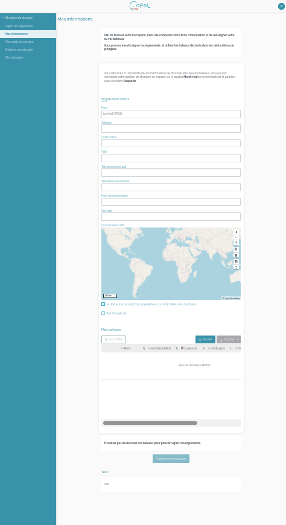
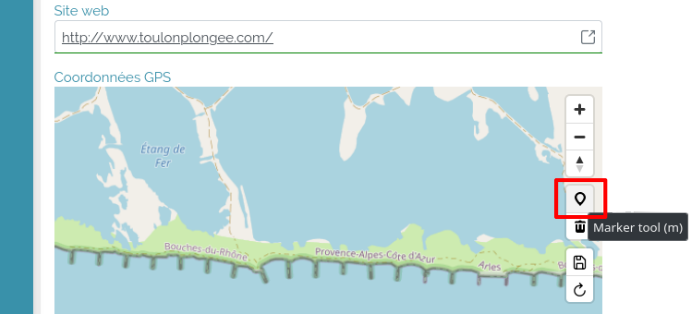
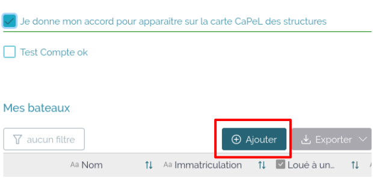
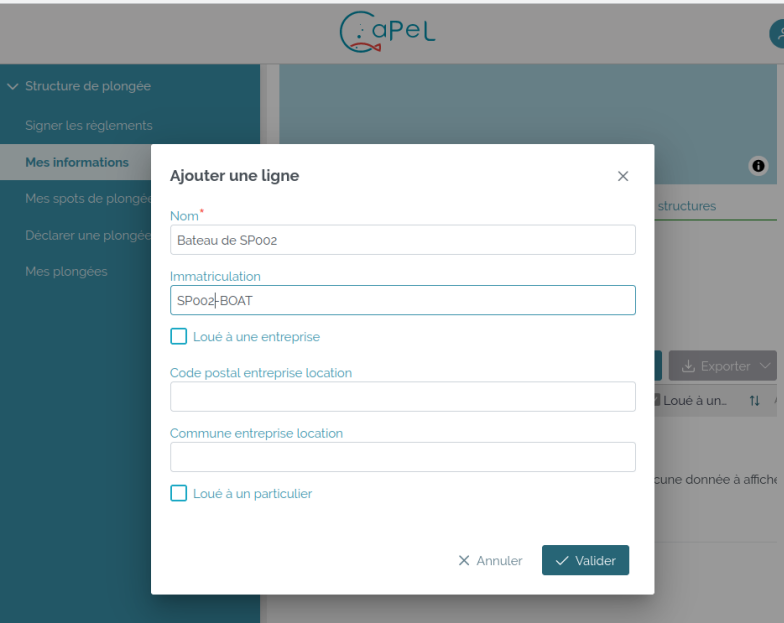
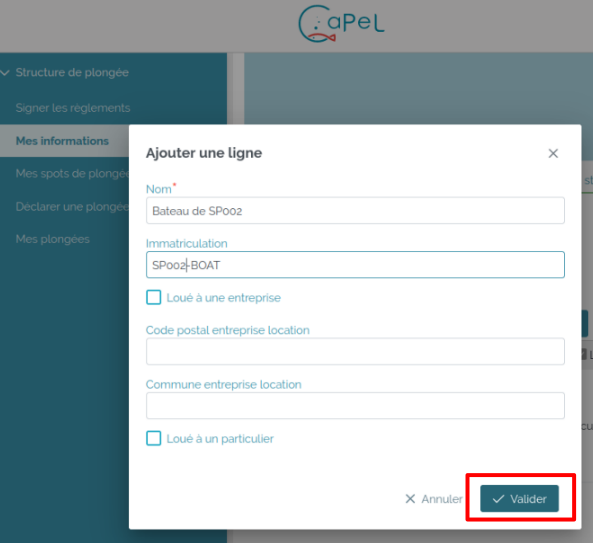
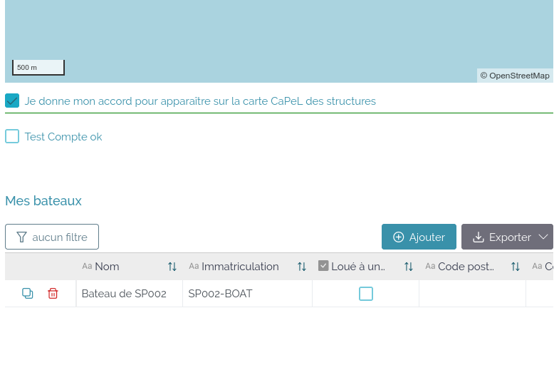

Se connecter en tant que structure de plongée.

### Page « Signer les règlements »
Après connexion, l’utilisateur est amené sur la page « Signer les règlements ».
> [Note JPO : J’aimerais donner une URL, mais je ne vois pas de permalien que l’on puisse mettre dans la documentation]

Il ne peut pas signer de règlement tant qu’il n’a pas complété sa fiche d’information et au moins un bateau.  
> [Note JPO : rien ne l’indique à l’écran]

Pour compléter la fiche d’information et déclarer un bateau, cliquer sur « Mes informations » :

L'utilisation est amené à la page « Mes informations »
> [Note JPO : J’aimerais donner une URL, mais je ne vois pas de permalien que l’on puisse mettre dans la documentation]

### Page « Mes informations »
> [Note JPO : J’aimerais donner une URL, mais je ne vois pas de permalien que l’on puisse mettre dans la documentation]

La page présente un formulaire à compléter :

Remplir les informations :

Pour positionner sur la carte l’emplacement de la structure, cliquer sur le bouton « Marker Tool » 

> [Note JPO : Cela aurait intéressant de traduire « Marker Tool » en français]

Une fois le marqueur positionné, sauvegarder en cliquant sur le bouton .

Cocher « Je donne mon accord pour apparaître sur la carte CaPeL des structures » pour que l’emplacement de la structure apparaisse sur la carte publique : https://capel.portcros-parcnational.fr/

> [Note JPO : À quoi sert la case « Test compte OK » ?]

#### Ajouter un bateau
Cliquer sur le bouton Ajouter 

Une fiche apparaît :

Compléter les informations du bateau :

Valider la fiche en cliquant sur le bouton « Valider » :

Le bateau créé apparaît dans le tableau « Mes bateaux » :

Pour créer un nouveau bateau, il existe deux choix :
- cliquer sur le bouton « Ajouter » comme ci-dessus
- dupliquer la fiche d’un bateau et la modifier

#### Dupliquer la fiche d’un bateau et la modifier
Cliquer sur l’icône Dupliquer :

Cliquer à nouveau sur l’icône Dupliquer pour confirmer la duplication :

Modifier les données en cliquant dans les cases (la sauvegarde est automatique.) :

Cliquer sur finaliser mon inscription pour enregistrer les données et finaliser l’inscription :

L’application revient sur l’onglet « Signer les règlements ».
