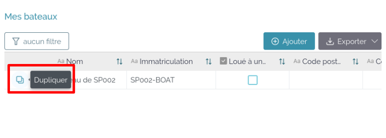

# Architecture générale

[backoffice]: https://backoffice.capel.portcros-parcnational.fr
[ghost]: https://capel.portcros-parcnational.fr/ghost/
[public]: https://capel.portcros-parcnational.fr
[superset]: https://capel-superset.makina-corpus.net/dashboard/list/?pageIndex=0&sortColumn=changed_on_delta_humanized&sortOrder=desc&viewMode=table

- Site public
  - [https://capel.portcros-parcnational.fr/][public]
  - "Lecture seule"
  - Point d'entrée vers le backoffice
  - Agrège les contenus de Ghost et du backoffice
- CMS (Ghost)
  - [https://capel.portcros-parcnational.fr/<b>ghost/</b>][ghost]
  - Contribution des pages, de la navigation, et du footer du site public
- Application et interface d’administration (LoCoKit)
  - [https://<b>backoffice.</b>capel.portcros-parcnational.fr/][backoffice]
  - Gestion de l'ensemble des données techniques
  - Paramétrages du site public
- Statistiques et tableaux de bord (Superset)
  - [https://capel-superset.makina-corpus.net/superset/][superset]

# Gestion du site public
Les contenus du site [public] sont gérés dans un CMS : Ghost.  
Certains contenus spécifiques sont extraits de l’application (LoCoKit) plutôt que du CMS.  
Les contenus sont ensuite transformés en site statique pour disposer de pages légères, rapides et d’un très haut niveau de sécurité.

Le CMS Ghost est accessible sur [https://capel.portcros-parcnational.fr/ghost/][ghost].

## Contribution dans Ghost

Le site dispose de plusieurs structures :
- Pages "classiques"
  - Raccourci d'édition avec `<adresse publique>/edit`
- Pages spécifiques
  - Page d'accueil
  - Footer
- Navigation principale : [`Settings > Navigation > Primary
navigation`](https://capel.portcros-parcnational.fr/ghost/#/settings/navigation)

Le contenu des pages est constitué de pavés (blocks) :
- Pavés principaux (primary)
  - Image
  - Markdown
  - HTML
  - Divider
  - Bookmark
- Pavés media (embed)
- Pavés spéciaux (snippets)
  - Carte principale
  - Statistiques
  - Vignettes de pages

## Mécanique de mises à jour du site public

La mise à jour du site public est démarrée dans les cas suivants :

- Depuis le [backoffice] automatiquement
  - Modification de la table `Plongée` (déclarations)
  - Modification de la table `Profil utilisateur` (structures de plongées)
  - Modification de la table `Spot de plongée`
- Depuis le [backoffice] manuellement
  - Modification de la table `Aire Marine Protégée`
  - Modification de la table `Paramètres du site public`
  - Modification de la table `Zone de protection`
- Depuis [Ghost] automatiquement
  - Modification de tout contenu ou paramètre

## Présentation des différentes parties du site

----
### Haut de page 

Les liens vers les pages proviennent du réglage [`Settings > Navigation > Primary
navigation`](https://capel.portcros-parcnational.fr/ghost/#/settings/navigation)

  

----
### Espace d'action

Ces deux boutons donnent accès à l’application.  

----
### Texte de présentation

Ce texte est celui du premier paragraphe de [{Pages}](https://capel.portcros-parcnational.fr/ghost/#/pages) > [Page d'accueil](https://capel.portcros-parcnational.fr/ghost/#/editor/page/60c236698582a800018424e2)  

----
### Compteurs

Ce bloc remonte automatiquement les informations de l’application dans le site à l’aide du bloc Statistiques (tag `custom-stats`) de [{Pages}](https://capel.portcros-parcnational.fr/ghost/#/pages) > (Page d'accueil).  

----
### Carte du site public

La carte et la légende sont paramétrées dans l’application :
[Interface d’administration de l’application](https://backoffice.capel.portcros-parcnational.fr/workspace/8dbf6e3c-3dc0-464e-9887-d2010fa8d689/database/10ce931c-4e48-40a2-b8f9-c1caba7d07c3) > Paramètres du site public : variables `MAP_CENTER`, `MAP_ZOOM`, `MAP_BASEMAP`, `MAP_STYLES` et `MAP_LEGENDS`, `SPOT_PUBLIC_FIELDS`.

La carte est constituée de fonds de plan (tuiles raster) et de données vectorielles.

- Fonds de cartes
  - Définis par la [clé `MAP_BASEMAP` (au format JSON) de la table *Paramètre du site public*](assets/basemap.png) du [backoffice]
- Données vectorielles (importées depuis le backoffice à chaque mise à jour du site)
  - Éléments de la table `Spot de plongée` ayant le `Statut`=`Public`
  - Éléments de la table `Zone de protection`
  - Éléments de la table `Profil utilisateur` filtré par `Type`=`Structure de plongée`) et ayant coché *"Je donne mon accord pour apparaître…"*
  - Élements de la table `Aire Marine Protégée`

Infobulles :
Pour chaque spot il y a :
- un tooltip (qui apparaît au survol) contenant le nom du spot
- un popup (qui apparaît au clic) contenant un tableau clé/valeur, dont chaque ligne est un champ, défini par SPOT_PUBLIC_FIELDS dans la table Paramètre du site public

----
### Résumé des pages de contenu

Ce bloc remonte automatiquement les informations des pages l’aide du bloc Vignettes de pages (tag `custom-blocks`) de [{Pages}](https://capel.portcros-parcnational.fr/ghost/#/pages) > (Page d'accueil).
Apparaissent ici :
- l’image fournie dans « Settings » de [{Pages}](https://capel.portcros-parcnational.fr/ghost/#/pages)
- le champ « Excerpt » (dans « Settings ») de [{Pages}](https://capel.portcros-parcnational.fr/ghost/#/pages)

----
### Réseaux sociaux

Les réseaux sociaux sont réglés dans l’application :
[Interface d’administration de l’application](https://backoffice.capel.portcros-parcnational.fr/workspace/8dbf6e3c-3dc0-464e-9887-d2010fa8d689/database/10ce931c-4e48-40a2-b8f9-c1caba7d07c3) > Paramètres du site public : variables `LINK_FACEBOOK`, `LINK_TWITTER`, `LINK_INSTAGRAM`, `LINK_YOUTUBE`, `LINK_PINTEREST`.

----
### Pied de page

Cette partie est gérée dans [{Pages}](https://capel.portcros-parcnational.fr/ghost/#/pages) > [Pied de page](https://capel.portcros-parcnational.fr/ghost/#/editor/page/60b77ea1f6c8f8000199d4a8)

----

# Application (en cours de rédaction)

Se connecter en tant que structure de plongée.

### Page « Signer les règlements »

Après connexion, l’utilisateur est amené sur la page « Signer les règlements ».

Il ne peut pas signer de règlement tant qu’il n’a pas complété sa fiche d’information et au moins un bateau.  

Pour compléter la fiche d’information et déclarer un bateau, cliquer sur « Mes informations » :

L'utilisation est amené à la page « Mes informations »

### Page « Mes informations »

La page présente un formulaire à compléter :

Remplir les informations :

Pour positionner sur la carte l’emplacement de la structure, cliquer sur le bouton « Marker Tool » 

Une fois le marqueur positionné, sauvegarder en cliquant sur le bouton .

Cocher « Je donne mon accord pour apparaître sur la carte CaPeL des structures » pour que l’emplacement de la structure apparaisse sur la carte publique : https://capel.portcros-parcnational.fr/

#### Ajouter un bateau

Cliquer sur le bouton Ajouter 

Une fiche apparaît :

Compléter les informations du bateau :

Valider la fiche en cliquant sur le bouton « Valider » :

Le bateau créé apparaît dans le tableau « Mes bateaux » :

Pour créer un nouveau bateau, il existe deux choix :

- cliquer sur le bouton « Ajouter » comme ci-dessus
- dupliquer la fiche d’un bateau et la modifier

#### Dupliquer la fiche d’un bateau et la modifier

Cliquer sur l’icône Dupliquer :

Cliquer à nouveau sur l’icône Dupliquer pour confirmer la duplication :

Modifier les données en cliquant dans les cases (la sauvegarde est automatique.) :

Cliquer sur finaliser mon inscription pour enregistrer les données et finaliser l’inscription :

L’application revient sur l’onglet « Signer les règlements ».
